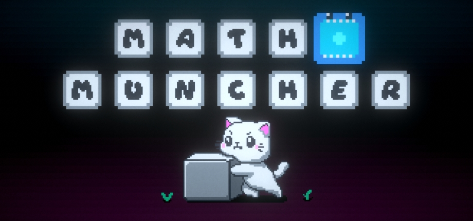
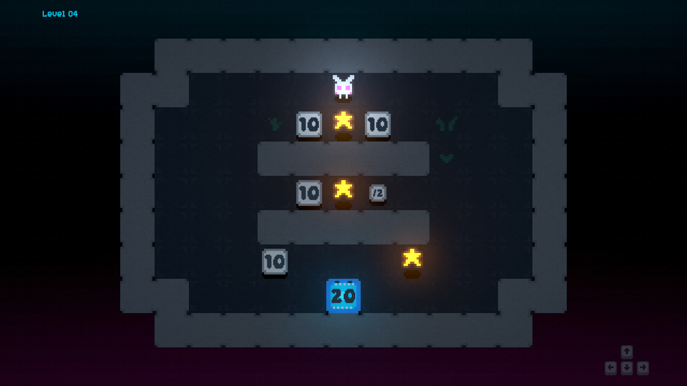
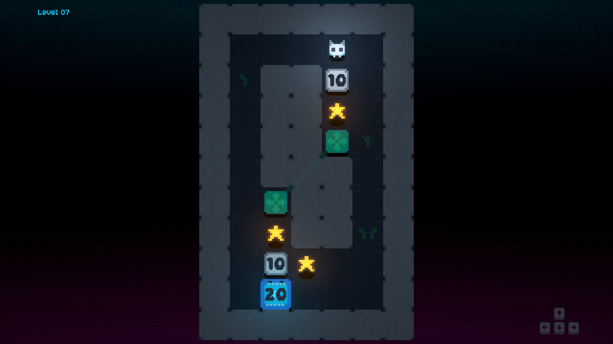
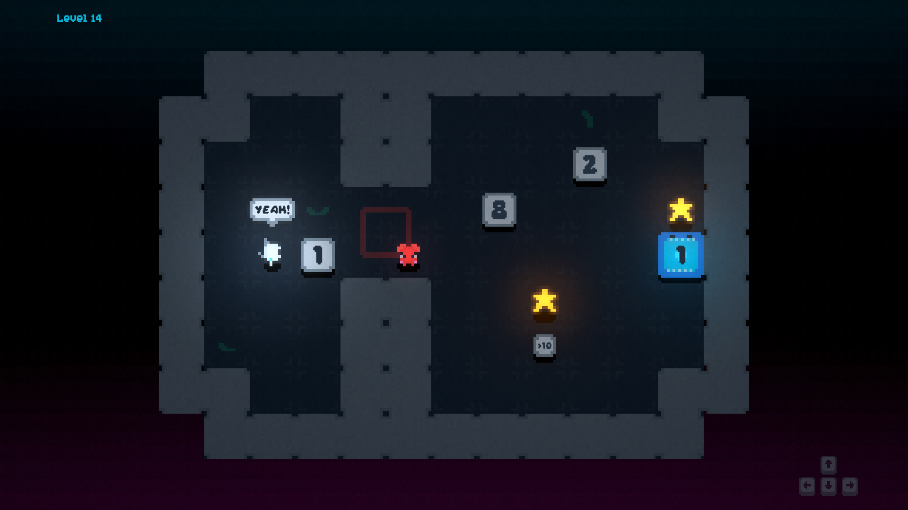
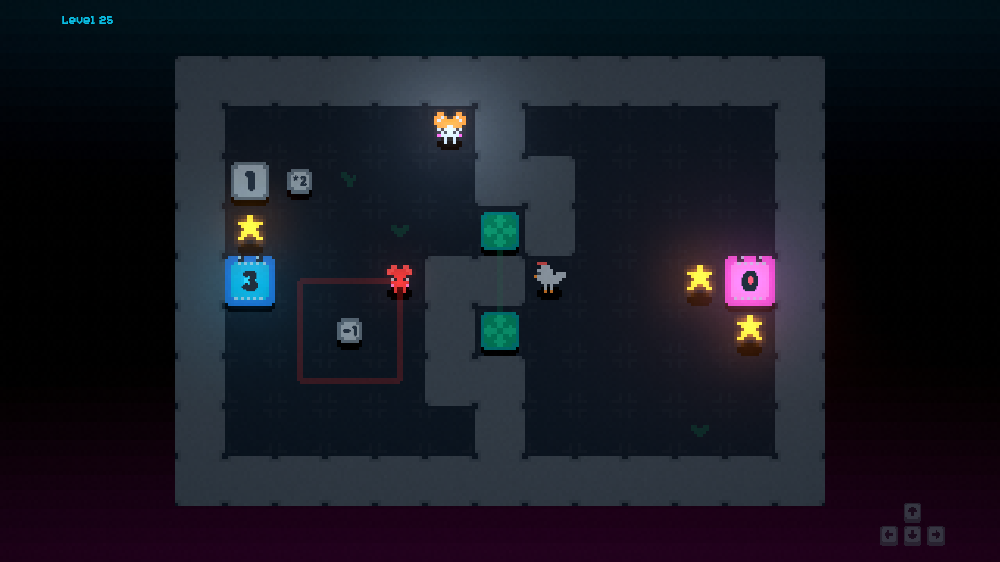

# Math Muncher

A relaxing block-pushing puzzle game where you do math and feed a hungry monster.

## Description

**Math Muncher** is a puzzle game where you push blocks to manipulate their values. In each level, the Math Muncher is hungry and demands blocks of a certain value. Keeping the Muncher fed and satisfied to advance to the next level and safely make your way back to civilization.

Featuring:

- **Unique Challenges**: Each level offers fun and brain-tickling obstacles.
- **Interactive Objects**: Buttons, switches, teleporters, and more.
- **60 Levels**: Can you solve them all?
- **Customization:** Collect stars to unlock different skins and escape in style.

Get your math brain in gear and feed the **Math Muncher**!

## Screenshots

## Trailer

